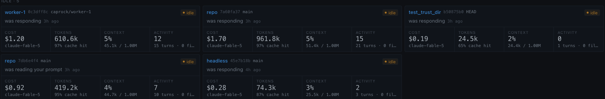

# Caprock

### See, steer, and orchestrate every Claude Code session on your machine.

[](https://github.com/dspv/caprock/releases)
[](LICENSE)
[](https://github.com/dspv/caprock/actions/workflows/ci.yml)


```bash
brew install dspv/tap/caprock
caprock up        # opens localhost:4173
```

No brew? Grab a binary from [Releases](https://github.com/dspv/caprock/releases).


*What each session is doing, and what it's costing — live.*

## What it is

Claude Code runs in your terminal. Caprock is the window into it.
One local binary. Your data never leaves your machine.

## Why

- **See it** — live activity, tokens, cost, and loop alerts per session.
- **Steer it** — spawn, pause, and kill sessions from the dashboard.
- **Trust it** — orchestrate agents that finish only when the tests pass.
- **Local-first** — loopback only, no servers, no telemetry, no account.

Every session on your machine, at a glance:



Where the money goes — by model, by project, over time:


## How it works

- **Observe** — watches every `claude` session via hooks + transcripts.
- **Control** — run and drive sessions from the browser.
- **Orchestrate** — a verified multi-agent team; a task is done only when green.

Nothing to change in your workflow — it starts by watching the sessions you already run.

## Get involved

- ⭐ **Star** it if it's useful — it helps others find it.
- 🐛 **Hit a bug?** [Open an issue](https://github.com/dspv/caprock/issues).
- 🤝 **Contribute** — see [CONTRIBUTING.md](CONTRIBUTING.md).

*A team version (shared dashboards, multi-user orchestration) is on the roadmap. Star to follow along.*

## More

[Docs](.ai/00-index.md) · [Changelog](CHANGELOG.md) · [Releasing](docs/RELEASING.md) · Apache-2.0

<sub>Building with an AI agent? Start at [CLAUDE.md](CLAUDE.md).</sub>
