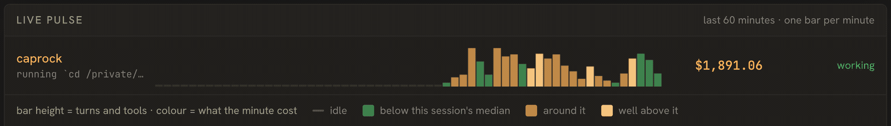
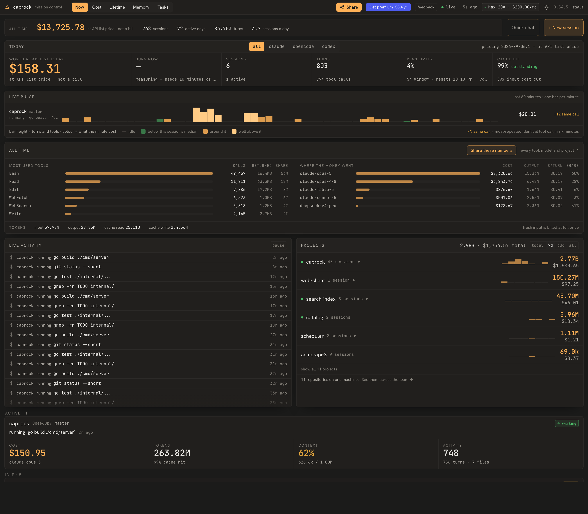
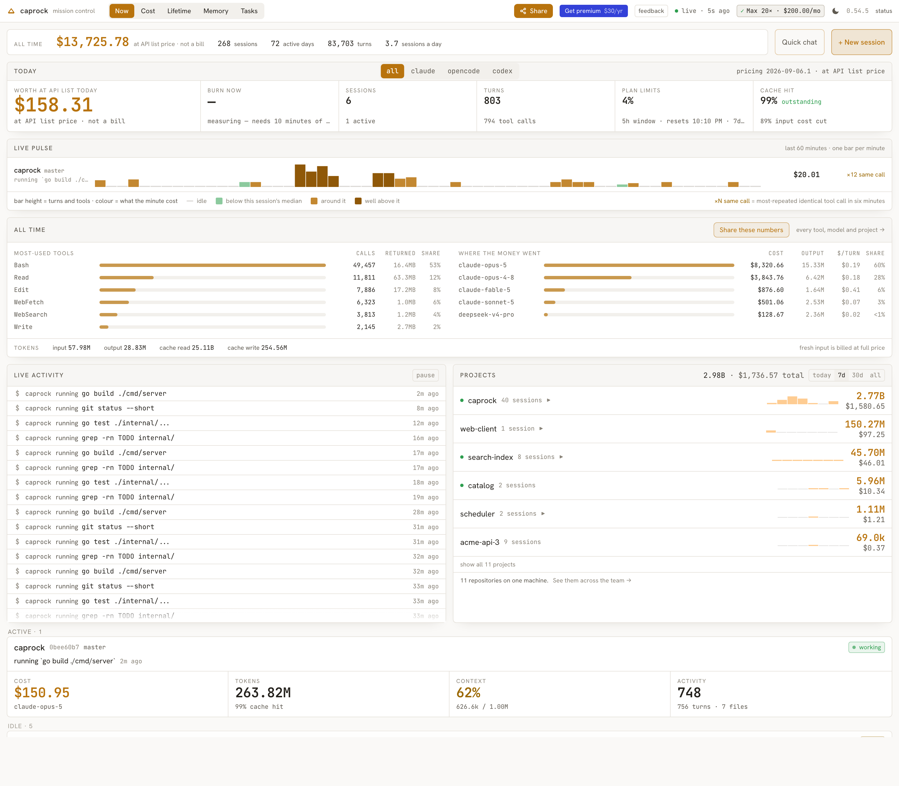
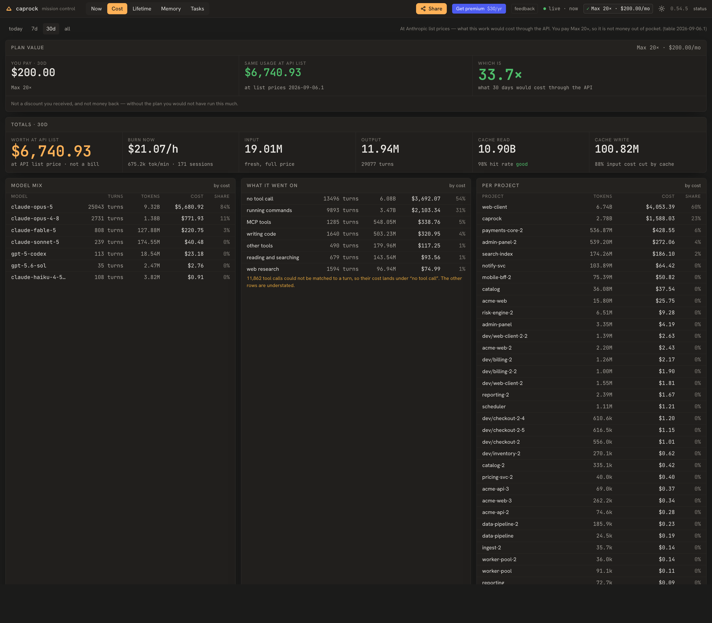
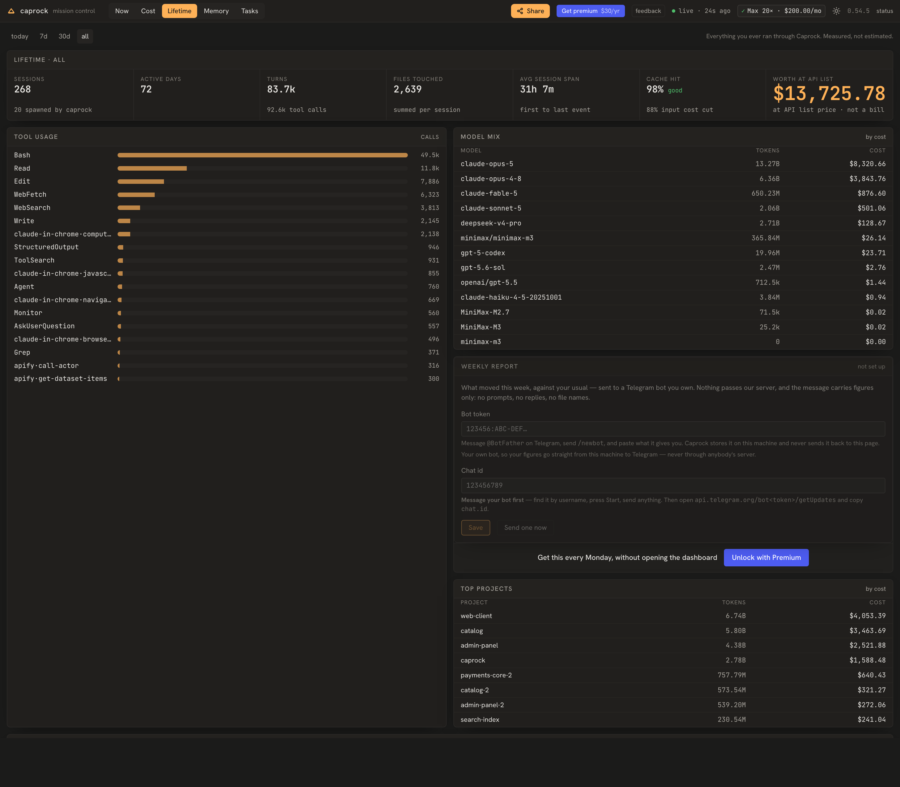
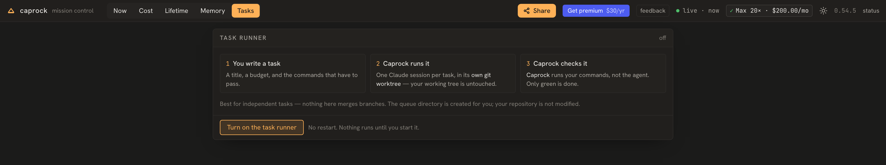

# Caprock

### See what your Claude Code is actually doing.



*Real capture, 46 seconds. One session working; the bars advance as the minutes roll over
and the cost ticks with them.*

[](https://github.com/dspv/caprock/releases)
[](LICENSE)
[](https://github.com/dspv/caprock/actions/workflows/ci.yml)


```bash
# macOS / Linux
brew install dspv/tap/caprock

# Windows
scoop bucket add dspv https://github.com/dspv/scoop-bucket
scoop install caprock

caprock up        # opens localhost:4173; offers to set up hooks + plan-limit status line
```

Have Go? `go install github.com/dspv/caprock/cmd/caprock@latest` — the dashboard
is embedded, so it works with no Node build. No package manager? Grab a binary
from [Releases](https://github.com/dspv/caprock/releases).

<details>
<summary><b>Coming from the old Python <code>caprock</code>?</b> Remove it first.</summary>

There was an earlier, unrelated Caprock on PyPI — a command-line stats tool that
read Claude Code usage from a proxy. This one is a Go binary with a dashboard and
shares nothing with it: different data, different install, same name. Remove the
old one so the two `caprock` commands don't shadow each other:

```bash
pipx uninstall caprock || pip uninstall -y caprock   # whichever you used
rm -rf ~/.caprock                                    # its old data
which caprock                                        # should now print nothing
```

Then install as above. **Nothing is lost:** this version reads the transcripts
Claude Code already writes, so your whole history appears on first run — no
migration, no import. (Only `~/.caprock/savings.jsonl` from the old tool is
dropped; copy it elsewhere first if you want to keep those numbers.)

</details>
On first run `caprock up` asks before adding its hook and status-line entries to
`~/.claude/settings.json` (it backs the file up and never touches your other
settings). Say no and it still reads your history from transcripts.

Run [OpenCode](https://github.com/sst/opencode) too? It is picked up
automatically and shown on the same screens — see [OpenCode](#opencode) for what
that covers and what it does not.



*Top: the live pulse — one bar per minute of the last hour, per session, so the
shape of a track is the shape of the work. Below: what every session is doing as
it happens, and what each repo costs you. Real numbers from a real machine.*

<details>
<summary>Light theme</summary>



*It follows your system by default, and the toggle in the header overrides it.*

</details>

## Your numbers, ready to publish

`caprock report` prints what your captured usage comes to at Anthropic list
prices, in a form you can paste somewhere:

```bash
caprock report              # a block for a post
caprock report --markdown   # the same facts as a table
caprock report --json       # machine-readable
```

```
$9,704 of Claude Code at API list prices on a $200/month plan — 41.6× the fee.
Priced from captured tokens at Anthropic list prices — what the same work would
have cost through the API. Not a bill, not a discount received, and not money
back: without the plan I would not have run this much.

2026-07-19 → 2026-08-22 · 33 active days
paid $233.33 over that window · same usage at API list $9,704
59,578 turns · 57 sessions · 26 projects
99% cache hit · 89% of input cost cut by cache
15,701,665,082 tokens read from cache · 128,597 fresh input
```

The caveat is part of the output, on every shape, because the number is not a
bill and not money saved — it is what the same work would have cost through the
API, and it is quotable enough to be worth making hard to quote without that.
The multiple compares your usage against the plan fee **for the window that was
measured**, so the report also prints the fee it divided by, with cents, so the
division checks out on sight. The raw token counts sit under the cache
percentages: they are what those percentages are computed from, and they are the
half of the cache story a reader can picture. Set your plan in
the dashboard header first; with no plan stated, `caprock report` says so and
shows no multiple rather than guessing one.

It reads from the running daemon and only issues GETs. Numbers move as you work,
so re-running it is the point — a figure you pasted last month is a figure about
last month.

## What it is

Claude Code runs in your terminal. Caprock is the window into it.
One local binary. Your data never leaves your machine.

**What that database holds.** Everything Claude Code read and wrote: your
prompts, its replies, and the full output of every tool call. That output is
where secrets end up — an API key printed by a command, a token in a `.env`
file that got read. The file is `0600` and nothing sends it anywhere, but it
is inside your backups, so treat it as you would your shell history: do not
put it in a bug report, and do not hand it to anyone debugging an issue for
you. `caprock down` and deleting the data directory removes all of it.

## OpenCode

Caprock also reads [OpenCode](https://github.com/sst/opencode) sessions, on the
same screens as Claude Code. A machine that runs both has its spend split
across two tools that each see half of it; here the projects list, the history
and the cost add up over both, and OpenCode sessions carry an `opencode` label
so you can still tell them apart.

Nothing to configure. If OpenCode is installed, Caprock finds its database and
reads it — no shim, no settings file to edit, and the database is opened
read-only. Sessions from before you installed Caprock are included, because
OpenCode keeps its own history.

Costs come from OpenCode's own figures rather than being recalculated here, so
they match what OpenCode reports. Like Caprock's own numbers, they are modelled
from list prices, not a bill.

**What is not there yet.** Observation only: the dashboard cannot start,
steer or stop an OpenCode session, and the task runner does not work with it.
Activity refreshes every few seconds rather than instantly, so the Now screen
lags a little behind a running session — the Cost and History screens are
unaffected. Verified on macOS; it builds and its tests pass on Linux and
Windows, but it has not been run on either.

## Why

- **See it** — live activity, tokens, cost, and loop alerts per session, plus
  what each repository costs you and who is working in it.
- **Find what Claude said** — the reasoning and the "here's what changed, here's
  what I still need from you" that otherwise lives only in terminal scrollback,
  searchable across every session.
- **See what it went on** — not just which model or which repository, but what
  the money was doing: running commands, writing code, reading and searching, or
  turns that called no tool at all.
- **Know what it's worth** — your measured usage priced at the API rate, against
  what your plan actually costs.
- **Steer it** — spawn, pause, and kill sessions from the dashboard.
- **Trust it** — an opt-in task runner whose tasks finish only when the checks
  Caprock runs come back green.
- **Local-first** — loopback only, no servers, no telemetry, no account. The one thing that can reach the network is an optional check for new releases, off until you turn it on.

What your usage is actually worth — the same work priced at the API rate,
against what your plan costs. Nobody else tells you this number:



And everything you have ever run through it — measured, not estimated:



## How it works

- **Observe** — watches every `claude` session via hooks + transcripts, and
  draws the last hour as a pulse: bar height is how much happened that minute,
  colour is what it cost.
- **Control** — run and drive sessions from the browser. When a session is
  waiting on you, **what did it ask?** shows the last thing Claude said without
  a trip to the terminal.
- **Orchestrate** — run queued tasks unattended, with a test gate; a task is done
  only when green. Opt-in, off by default — see below.

Nothing to change in your workflow — it starts by watching the sessions you already run.

## Run tasks unattended (advanced, opt-in)



This is the one part of Caprock that starts sessions on its own, so it is off
unless you ask for it. Turn it on from the Tasks screen — the button creates the
queue directory and starts the board without restarting the daemon. The honest description is **an unattended task runner
with a test gate**: the closest thing you already know is a git worktree plus a
shell loop. What it adds is that a worker cannot stop early, a failing check
bounces back with its output attached, spend is attributed per task against a
budget, and there is a board showing where everything is.

```bash
caprock up --hive ~/caprock-tasks --repo ~/dev/myproject
```

`--hive` is a queue directory; Caprock creates it, and seeds it with a README
and an example task so it explains itself. `--repo` is the checkout the work
happens in (default: the current directory). Your own working tree is never
touched — each worker gets its **own git worktree** at
`<repo>/.caprock-worktrees/<worker-id>`, on a branch named
`caprock/<worker-id>`.

```
~/caprock-tasks/
├── README.md              # what this directory is
├── tasks/<id>.md          # one file per task — the source of truth
├── agents/<id>/           # identity, memory, inbox/, outbox/
├── approvals/             # decisions waiting on you
├── verifications/         # captured output of every check that ran
└── ledger.jsonl           # append-only log of every state change
```

A task is a markdown file with YAML front matter. This is a complete one:

```yaml
---
id: t-healthz
title: Add a /healthz endpoint
status: inbox
assignee: null
budget_usd: 3
done_criteria:
  - go test ./...
  - go vet ./...
verify_rounds_used: 0
---
Add a GET /healthz returning 200 and {"status":"ok"}. Cover it with a test in
the existing handler test file.
```

Create one from the dashboard's Tasks screen, or from a terminal:

```bash
caprock task create --title "Add a /healthz endpoint" \
  --done-criteria "go test ./..." --done-criteria "go vet ./..." --budget 3
caprock tasks          # the board
caprock status         # includes which hive is in force
```

Then press **Start orchestrator** on the Tasks screen. Nothing runs until you
do.

### What `done_criteria` is

Plain shell commands. When a worker reports it has finished, **Caprock** runs
them — not the agent — in that worker's worktree, with a five-minute ceiling
each. Every command exits 0 and the task moves to `done`. Any command fails and
the output bounces straight back to the worker to try again; after three rounds
it stops and asks you. A task with no `done_criteria` cannot be verified, so it
is never marked done on a worker's say-so.

They run in a real checkout of your repository, so treat them as commands you
are running yourself: `go build ./...` will leave a binary behind exactly as it
would in your own tree.

### Before you turn it on

- **Workers run with permission prompts skipped** (`--dangerously-skip-permissions`),
  in a worktree of your repo. A task body is acted on without a further
  confirmation from you. Give each task a budget.
- **Only for independent tasks.** Nothing here merges branches, and nothing
  notices two workers editing the same file. Give concurrent tasks separate
  ground.
- **You land the work.** When a task is done, open its card: it shows the diff,
  the checks that passed, the branch, and the git command that merges it. Caprock
  never writes to your branches itself.

Found a bug, or something that did not explain itself? The **feedback** button
in the header opens a prefilled GitHub issue in your browser — nothing is sent
from the dashboard, and what gets attached is on screen before you press it.

## Updating

Use the command that matches how you installed it:

```bash
brew upgrade caprock                                    # Homebrew
scoop update caprock                                    # Scoop
go install github.com/dspv/caprock/cmd/caprock@latest   # go install
```

Then restart the daemon so the new binary is the one running:

```bash
caprock down && caprock up
```

`caprock down` stops the daemon and leaves your database alone — nothing is
lost, and history from before the upgrade stays exactly where it was. Check
what you ended up on with `caprock status`.

Caprock can also tell you when a release is out: turn on release checks from
the banner on the Now screen, or on the status page. That is the only outbound
call it makes, it is off until you switch it on, and it sends nothing about
you. It never installs anything by itself — it shows the one command above for
your install method, and you run it.

Downloaded the binary directly? Replace it with a fresh one from
[Releases](https://github.com/dspv/caprock/releases) and restart.

## Start it at login

By default the daemon stops when you reboot, and nothing records until you run
`caprock up` again. One command fixes that for good:

```bash
caprock service install     # start at login, from now on
caprock service status      # is it registered? is it running? which file says so?
caprock service uninstall   # undo it
```

It registers the daemon with **your own operating system's** login supervisor —
no root, no installer, nothing outside your home directory:

- **macOS** — a LaunchAgent at `~/Library/LaunchAgents/dev.caprock.daemon.plist`,
  loaded with `launchctl`. It restarts the daemon if it crashes.
- **Linux** — a systemd *user* unit at `~/.config/systemd/user/caprock.service`,
  enabled with `systemctl --user enable --now`. It restarts the daemon if it
  crashes. (No systemd user session? The command says so and tells you what to
  do instead — it does not leave a file behind that nothing reads.)
- **Windows** — a logon script in your Startup folder. It starts Caprock at every
  logon; Windows has no per-user crash supervisor without admin rights, so a
  mid-session crash is not auto-restarted.

The installed service runs `caprock up --foreground --no-open --no-hooks` on
your configured port, with your data directory. Three deliberate choices there:
it stays in the foreground so the supervisor can actually supervise it, it never
opens a browser tab at login, and it never edits `~/.claude/settings.json` —
hook and status-line registration stays a decision you make interactively.

`caprock service install` prints the exact path it wrote and the command that
undoes it, and running it twice is a no-op rather than a second copy. Stopping
the daemon with `caprock down` keeps it stopped: the service is configured to
restart it only when it *crashes*, never when you shut it down on purpose.

## Get involved

- ⭐ **Star** it if it's useful — it helps others find it.
- 🐛 **Hit a bug?** [Open an issue](https://github.com/dspv/caprock/issues).
- 🤝 **Contribute** — see [CONTRIBUTING.md](CONTRIBUTING.md).

*A team version (shared dashboards, multi-user orchestration) is on the roadmap. Star to follow along.*

## More

[Docs](.ai/00-index.md) · [Changelog](CHANGELOG.md) · [Releasing](docs/RELEASING.md) · [Code of Conduct](CODE_OF_CONDUCT.md) · [Security](SECURITY.md) · Apache-2.0

<sub>Building with an AI agent? Start at [CLAUDE.md](CLAUDE.md).</sub>

## Project map

This repo (**[`dspv/caprock`](https://github.com/dspv/caprock)**) is the home of the
Caprock binary and its docs. The rest of the project:

| Where                                                         | What                                                               |
| ------------------------------------------------------------- | ------------------------------------------------------------------ |
| **[caprock.dev](https://caprock.dev)**                        | Website — landing, install guide, changelog                        |
| **[dspv/homebrew-tap](https://github.com/dspv/homebrew-tap)** | Homebrew formula (macOS / Linux) — `brew install dspv/tap/caprock` |
| **[dspv/scoop-bucket](https://github.com/dspv/scoop-bucket)** | Scoop bucket (Windows) — `scoop install caprock`                   |
| **[Releases](https://github.com/dspv/caprock/releases)**      | Prebuilt binaries for every OS/arch                                |

The Homebrew formula and Scoop manifest are generated and pushed from here on
each release ([docs/RELEASING.md](docs/RELEASING.md)); the website lives in its
own repo and deploys to caprock.dev.
