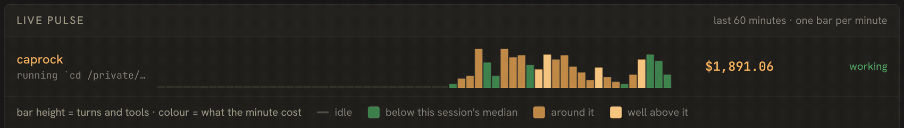
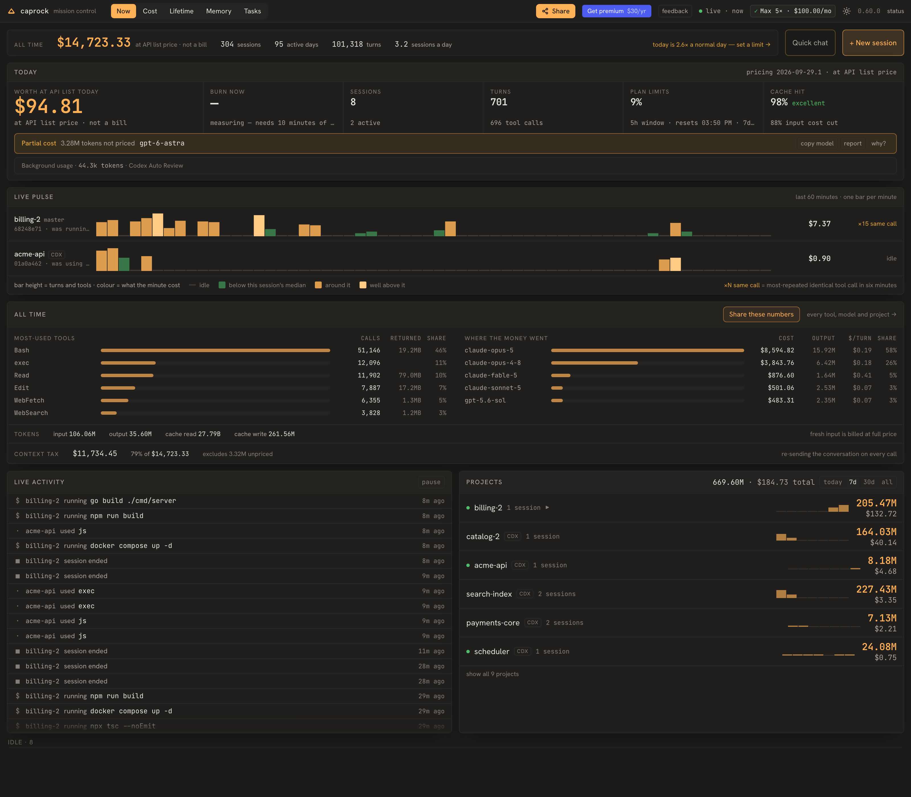
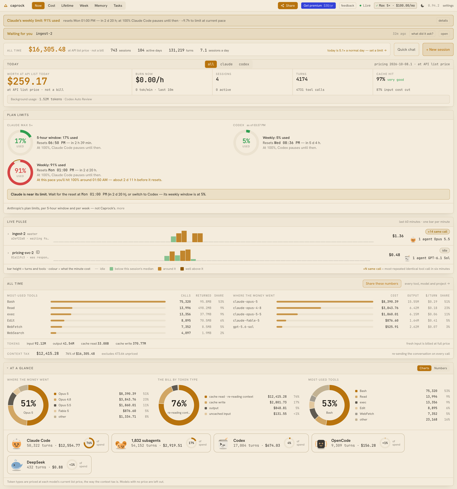
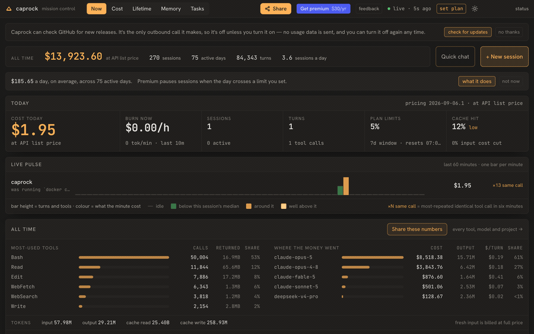
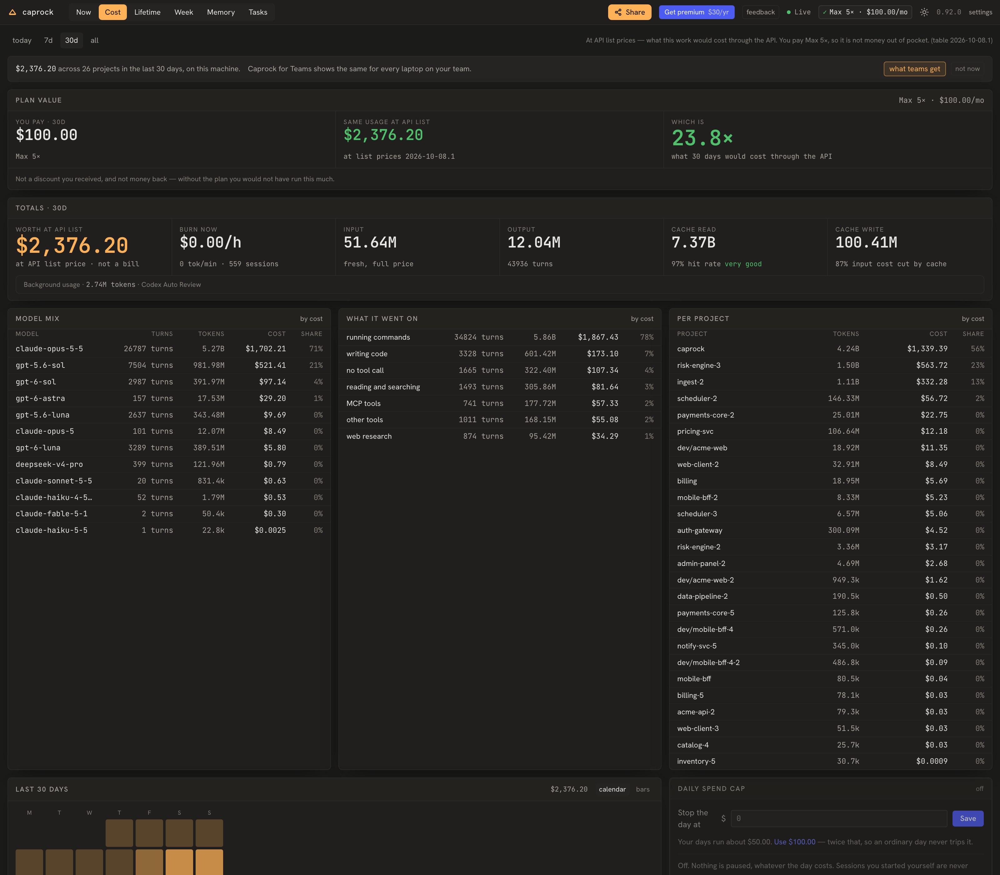
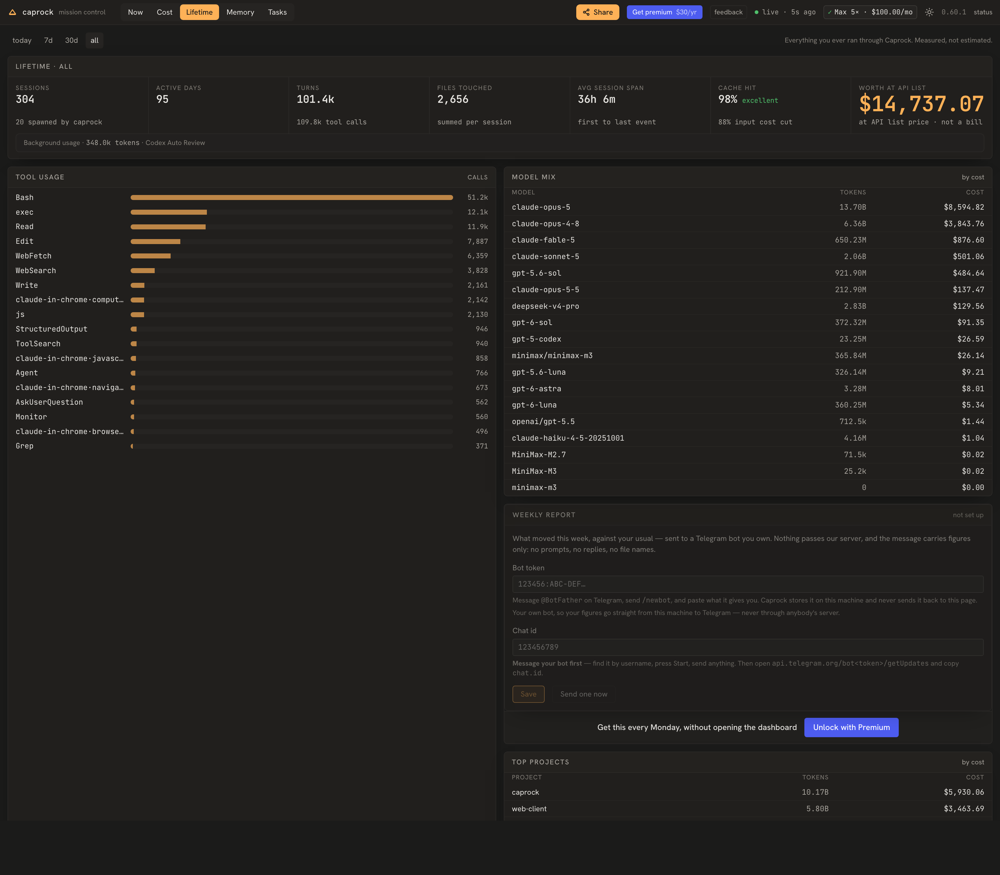
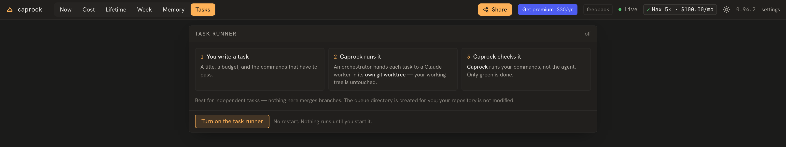

# Caprock

### See what your Claude Code is actually doing.



*Real capture, 46 seconds. One session working; the bars advance as the minutes roll over
and the cost ticks with them.*

[](https://github.com/dspv/caprock/releases)
[](LICENSE)
[](https://github.com/dspv/caprock/actions/workflows/ci.yml)


```bash
# macOS / Linux
brew install dspv/tap/caprock

# Windows
scoop bucket add dspv https://github.com/dspv/scoop-bucket
scoop install caprock
# winget too, once Microsoft has merged the manifest for a release:
#   winget install dspv.caprock

caprock up        # opens localhost:22776; offers to set up hooks + plan-limit status line
```

Have Go? `go install github.com/dspv/caprock/cmd/caprock@latest` — the dashboard
is embedded, so it works with no Node build. No package manager? Grab a binary
from [Releases](https://github.com/dspv/caprock/releases).

<details>
<summary><b>Or let Claude Code install it</b> — paste one prompt into a fresh Claude Code message.</summary>

It picks the right command for your machine, so there is nothing to choose. The
`--yes` is load-bearing: consent for the hook is refused rather than assumed
when stdin is not a terminal, which is what an agent's shell gives it, so
without the flag you would get a dashboard that never sees a session.

The wording was tested against five agents given no other context. An earlier
draft was refused outright by one of them, and the two lines it objected to
were both ours meaning well: "do not start or type into any claude session"
(our Rule 7, which reads as *do not tell the user*) and "show me the error
instead of trying another source" (meant to stop a lookalike package being
installed, which reads as *stop verifying*). Both are gone. It now asks the
agent to check whatever it wants and to show you the settings diff — the same
scepticism, invited rather than forbidden.

```text
Please install Caprock for me. It is an open-source local dashboard that shows
what my Claude Code sessions are doing and what they cost — Apache-2.0, runs on
my machine: https://github.com/dspv/caprock

  macOS/Linux:  brew install dspv/tap/caprock
  Windows:      scoop bucket add dspv https://github.com/dspv/scoop-bucket
                scoop install caprock

Then run `caprock up --yes`. That flag lets it add its own hook to my Claude
Code settings, which is how it sees sessions live. Show me the change it makes
to ~/.claude/settings.json so I can see it myself.

Check anything you want to check first, and ask me if something does not add
up. When it is running, tell me the URL it prints and stop there.
```

</details>

<details>
<summary><b>Coming from the old Python <code>caprock</code>?</b> Remove it first.</summary>

There was an earlier, unrelated Caprock on PyPI — a command-line stats tool that
read Claude Code usage from a proxy. This one is a Go binary with a dashboard and
shares nothing with it: different data, different install, same name. Remove the
old one so the two `caprock` commands don't shadow each other:

```bash
pipx uninstall caprock || pip uninstall -y caprock   # whichever you used
rm -rf ~/.caprock                                    # its old data
which caprock                                        # should now print nothing
```

Then install as above. **Nothing is lost:** this version reads the transcripts
Claude Code already writes, so your whole history appears on first run — no
migration, no import. (Only `~/.caprock/savings.jsonl` from the old tool is
dropped; copy it elsewhere first if you want to keep those numbers.)

</details>
On first run `caprock up` asks before adding its hook and status-line entries to
`~/.claude/settings.json` (it backs the file up and never touches your other
settings). Say no and it still reads your history from transcripts.

Run [OpenCode](https://github.com/sst/opencode),
[Codex](https://developers.openai.com/codex),
[DeepSeek Harness](https://github.com/deepseek-ai/DeepSeek-Harness) or
[Gemini CLI](https://github.com/google-gemini/gemini-cli) too? All are shown on
the same screens — OpenCode from its own database, Codex and DeepSeek Harness
from the transcripts they write, Gemini through the telemetry it writes when
Caprock starts it. See
[OpenCode, Codex and DeepSeek Harness](#opencode-codex-and-deepseek-harness) for
what that covers and what it does not.

Caprock starts Codex, OpenCode and Gemini CLI sessions too: whichever of them
is installed appears next to Claude Code in the New Session dialog — same
terminal, same directory picker, its own filter chip — and the dialog remembers
the one you picked last. A Codex or OpenCode session started here shows its
cost and answers on the same page as its terminal, and one that has ended can
be continued with "continue here". "Continue in…" on any session starts a new
one in the agent of your choice with a summary you read first — what the agent
last said, what changed in the folder, the PRs it opened. For Gemini, install
the CLI
(`npm install -g @google/gemini-cli`).
With a Gemini key set (see [Premium](#premium) for where), Caprock passes it to
the child process. Gemini has no hooks and writes no transcript, but it does
write OpenTelemetry, and Caprock asks it to write that to a file it then reads;
what you ask it is kept there too, so the Memory screen can find a Gemini
session by your question. Starting and watching Gemini sessions is free, like
every other agent.



*Top: the live pulse — one bar per minute of the last hour, per session, so the
shape of a track is the shape of the work. Below: what every session is doing as
it happens, and what each repo costs you. Real numbers from a real machine.*

<details>
<summary>Light theme</summary>



*It follows your system by default, and the toggle in the header overrides it.*

</details>

## Your numbers, ready to publish

`caprock report` prints what your captured usage comes to at API list prices,
in a form you can paste somewhere. When the total includes Codex, Gemini or
DeepSeek turns, the caveat names every vendor whose list was used and the
headline stops calling it all Claude Code:

```bash
caprock report              # a block for a post
caprock report --markdown   # the same facts as a table
caprock report --json       # machine-readable
```

```
$9,704 of Claude Code at API list prices on a $200/month plan — 41.6× the fee.
Priced from captured tokens at Anthropic list prices — what the same work would
have cost through the API. Not a bill, not a discount received, and not money
back: without the plan I would not have run this much.

2026-07-19 → 2026-08-22 · 33 active days
paid $233.33 over that window · same usage at API list $9,704
59,578 turns · 57 sessions · 26 projects
99% cache hit · 89% of input cost cut by cache
15,701,665,082 tokens read from cache · 128,597 fresh input
```

The caveat is part of the output, on every shape, because the number is not a
bill and not money saved — it is what the same work would have cost through the
API, and it is quotable enough to be worth making hard to quote without that.
The multiple compares your usage against the plan fee **for the window that was
measured**, so the report also prints the fee it divided by, with cents, so the
division checks out on sight. The raw token counts sit under the cache
percentages: they are what those percentages are computed from, and they are the
half of the cache story a reader can picture. Set your plan in
the dashboard header first; with no plan stated, `caprock report` says so and
shows no multiple rather than guessing one.

It reads from the running daemon and only issues GETs. Numbers move as you work,
so re-running it is the point — a figure you pasted last month is a figure about
last month.

## Take the record out

Every agent Caprock reads — Claude Code, Codex, OpenCode, Gemini CLI, DeepSeek —
lands in the same tables with the same columns. `caprock export` writes one of
them out, for a spreadsheet, a notebook or your own warehouse:

```bash
caprock export --since 30d > events.tsv           # one row per turn and tool call
caprock export sessions --format csv --out s.csv  # one row per session
caprock export --agent codex --format jsonl       # one agent, as JSON lines
```

It reads the database read-only, so it works with the daemon stopped. The
columns, what each agent's source maps to, and what is deliberately left out are
in [`docs/schema.md`](docs/schema.md). The record also outlives the agents' own:
Claude Code removes its transcripts after 30 days by default, and Caprock
keeps what it read from them.

## What it is

Claude Code runs in your terminal. Caprock is the window into it.
One local binary. Your data never leaves your machine.

**What that database holds.** Everything Claude Code read and wrote: your
prompts, its replies, and the full output of every tool call. That output is
where secrets end up — an API key printed by a command, a token in a `.env`
file that got read. The file is `0600` and nothing sends it anywhere, but it
is inside your backups, so treat it as you would your shell history: do not
put it in a bug report, and do not hand it to anyone debugging an issue for
you. `caprock down` and deleting the data directory removes all of it.

## What your context is costing you



Every call re-sends the whole conversation before it does anything. You pay for
that on every call, and it grows as the session does — so the 300th call in a
long session costs real money before it has run.

Caprock puts the price where you are already looking. A running session says
what its **next call** costs at the context it is carrying. The lifetime
breakdown says what that has come to. On the machine this was recorded on, it
is 79% of the bill.

The number is exact, not modelled: the context of every call comes from the
token counts Claude Code itself records, priced per model from the pricing
table. Calls that arrive without a way to attach them to the turn that paid for
them are excluded and counted, so a figure is never quietly short.

## OpenCode, Codex and DeepSeek Harness

Caprock also reads [OpenCode](https://github.com/sst/opencode),
[Codex](https://developers.openai.com/codex) and
[DeepSeek Harness](https://github.com/deepseek-ai/DeepSeek-Harness) sessions, on
the same screens as Claude Code. A machine that runs more than one has its spend
split across tools that each see part of it; here the projects list, the history
and the cost add up over all of them, and the rows carry an `oc`, `cdx` or `dsh`
mark so you can still tell them apart.

**Or see one at a time.** The Now screen carries
`all / claude / opencode / gemini / codex / deepseek` in the middle of its
header, and it applies to the whole screen — today's totals, the live pulse, the
activity feed, the projects list and the session cards all answer the same
question. It appears only on a machine that runs more than one.

Nothing to configure for any of them. OpenCode is found through its own
database, opened read-only; Codex through the transcript it writes per session,
under `$CODEX_HOME` (or `~/.codex`), archived sessions included; DeepSeek
Harness through the transcript it writes per session. No shim, no
settings file to edit, and sessions from before you installed Caprock are
included, because each tool keeps its own history. What OpenCode, Codex and
DeepSeek Harness wrote back is searchable on the Memory screen beside Claude's.

**The cost works differently for each, and it matters.** OpenCode computes its
own figures and Caprock passes them through, so they match what OpenCode
reports. Codex reports how many tokens a turn used but never what it cost, so
those are priced from Caprock's own table of OpenAI list prices. Like every
number here, both are modelled from list prices, not a bill.

Three things about Codex figures worth knowing:

- A turn whose transcript does not name the model it ran on keeps its tokens and
  shows **no cost**, rather than a guessed one. `caprock status` reports how many.
- About half of Codex's token reports give a total without breaking it down by
  kind. Caprock counts that total as input, which is the unqualified rate — so
  for those turns the cost is an **upper bound**: any part of it that was really
  a cached read cost a tenth or less of what is shown.
- OpenAI bills the gpt-6 models for writing to their cache, at 1.25x input, but
  Codex does not report how many tokens were written. Those arrive as plain
  input, so a gpt-6 figure can be low by up to a quarter of that unreported
  share.

**Codex's plan limits** sit on the Cost screen under Claude Code's, labelled as
Codex's: the 5-hour and weekly windows as Codex last wrote them into a session
transcript, with the time it wrote them. Which windows appear depends on the
plan — some ChatGPT plans have no 5-hour window. They are shown as measured and
never forecast.

**What is not there yet.** Observation only: the dashboard cannot start, steer
or stop an OpenCode, Codex or DeepSeek Harness session, and the task runner does
not work with them. Activity refreshes every few seconds rather than instantly, so the Now
screen lags a little behind a running session — the Cost and Lifetime screens
are unaffected. Verified on macOS; it builds and its tests pass on Linux and
Windows, but it has not been run on either.

## Why

- **See it** — live activity, tokens, cost, and loop alerts per session, plus
  what each repository costs you and who is working in it.
- **Find what Claude said** — the reasoning and the "here's what changed, here's
  what I still need from you" that otherwise lives only in terminal scrollback,
  searchable across every session.
- **Pick up where you left off** — a new session in a folder you have worked in
  is handed the last thing the previous one said there (on by default, off in
  settings). You can measure whether that helps: an opt-in setting holds it back
  from one new session in four and the Memory screen compares the two.
- **See what it went on** — not just which model or which repository, but what
  the money was doing: running commands, writing code, reading and searching, or
  turns that called no tool at all.
- **Know what it's worth** — your measured usage priced at the API rate, against
  what your plan actually costs.
- **1-click terminal** — the Terminal button on a project opens the session
  Caprock is running there, picks up one started elsewhere, or starts a new one.
  A running card on Now opens in its terminal too. Session pages and projects
  link to the repository and the pull requests a session opened.
- **Steer it** — spawn, pause, and kill sessions from the dashboard, and continue
  one that has ended. Each card says what the session was about and when it was
  worked in, says why when it cannot be continued, and ended sessions are
  searchable. After a reboot the Now screen lists the sessions it interrupted,
  each with continue.
- **Trust it** — an opt-in task runner whose tasks finish only when the checks
  Caprock runs come back green.
- **Local-first** — loopback only, no servers, no telemetry, no account. Nothing
  reaches the network unless you switch it on: the release check, the Gemini
  chat on your own key, and the weekly report and phone alerts to your own
  Telegram bot are each off by default.

What your usage is actually worth — the same work priced at the API rate,
against what your plan costs. Nobody else tells you this number:



And everything you have ever run through it — measured, not estimated:



## How it works

- **Observe** — watches every `claude` session via hooks + transcripts, and
  draws the last hour as a pulse: bar height is how much happened that minute,
  colour is what it cost.
- **Control** — run and drive sessions from the browser. When a session is
  waiting on you, **what did it ask?** shows the last thing Claude said without
  a trip to the terminal.
- **Orchestrate** — run queued tasks unattended, with a test gate; a task is done
  only when green. Opt-in, off by default — see below.

Nothing to change in your workflow — it starts by watching the sessions you already run.

## Run tasks unattended (advanced, opt-in)



This is the one part of Caprock that starts sessions on its own, so it is off
unless you ask for it. Turn it on from the Tasks screen — the button creates the
queue directory and starts the board without restarting the daemon. The honest description is **an unattended task runner
with a test gate**: the closest thing you already know is a git worktree plus a
shell loop. What it adds is that a worker cannot stop early, a failing check
bounces back with its output attached, spend is attributed per task against a
budget, and there is a board showing where everything is.

```bash
caprock up --hive ~/caprock-tasks --repo ~/dev/myproject
```

`--hive` is a queue directory; Caprock creates it, and seeds it with a README
and an example task so it explains itself. `--repo` is the checkout the work
happens in (default: the current directory). Your own working tree is never
touched — each worker gets its **own git worktree** at
`<repo>/.caprock-worktrees/<worker-id>`, on a branch named
`caprock/<worker-id>`.

```
~/caprock-tasks/
├── README.md              # what this directory is
├── tasks/<id>.md          # one file per task — the source of truth
├── agents/<id>/           # identity, memory, inbox/, outbox/
├── approvals/             # decisions waiting on you
├── verifications/         # captured output of every check that ran
└── ledger.jsonl           # append-only log of every state change
```

A task is a markdown file with YAML front matter. This is a complete one:

```yaml
---
id: t-healthz
title: Add a /healthz endpoint
status: inbox
assignee: null
budget_usd: 3
done_criteria:
  - go test ./...
  - go vet ./...
verify_rounds_used: 0
---
Add a GET /healthz returning 200 and {"status":"ok"}. Cover it with a test in
the existing handler test file.
```

Create one from the dashboard's Tasks screen, or from a terminal:

```bash
caprock task create --title "Add a /healthz endpoint" \
  --done-criteria "go test ./..." --done-criteria "go vet ./..." --budget 3
caprock tasks          # the board
caprock status         # includes which hive is in force
```

Then press **Start orchestrator** on the Tasks screen. Nothing runs until you
do.

### What `done_criteria` is

Plain shell commands. When a worker reports it has finished, **Caprock** runs
them — not the agent — in that worker's worktree, with a five-minute ceiling
each. Every command exits 0 and the task moves to `done`. Any command fails and
the output bounces straight back to the worker to try again; after three rounds
it stops and asks you. A task with no `done_criteria` cannot be verified, so it
is never marked done on a worker's say-so.

They run in a real checkout of your repository, so treat them as commands you
are running yourself: `go build ./...` will leave a binary behind exactly as it
would in your own tree.

### Before you turn it on

- **Workers run with permission prompts skipped** (`--dangerously-skip-permissions`),
  in a worktree of your repo. A task body is acted on without a further
  confirmation from you. Give each task a budget.
- **Only for independent tasks.** Nothing here merges branches, and nothing
  notices two workers editing the same file. Give concurrent tasks separate
  ground.
- **You land the work.** When a task is done, open its card: it shows the diff,
  the checks that passed, the branch, and the git command that merges it. Caprock
  never writes to your branches itself.

Found a bug, or something that did not explain itself? The **feedback** button
in the header opens a prefilled GitHub issue in your browser — nothing is sent
from the dashboard, and what gets attached is on screen before you press it.

## Premium

Everything above is free, Apache-2.0, and stays that way — including the cost
of every provider Caprock can see, Anthropic or not.

Premium adds the things that act on what you are looking at.

**A daily cap.** Pass a number you set, and Caprock pauses the sessions it
started — paused, not killed, and never a session you started yourself. Built.

**Ask Gemini about your numbers, on your own key.** A second model inside
Caprock, billed to you by Google at their prices. Get a key from
[Google AI Studio](https://aistudio.google.com/apikey) and either export
`GEMINI_API_KEY` before `caprock up`, or paste it into the field on the Cost
screen. An exported variable wins; a pasted key is written to the config file
with owner-only permissions and never leaves the machine or comes back out of
the API.

On the Cost screen, a question carries today's and
the week's spend, top projects and models — so the answers are about your
machine; your prompts, replies, and tool output are never sent. A question costs
about 0.04 cents on Flash Lite and 1 cent on Pro, priced before you spend it.
Built.

**A weekly report** of what moved — spend, the projects that drove it, and
what changed against the median of the last four weeks — sent to your own
Telegram bot.

**Where each tool failed.** On Lifetime a tool's row opens into its calls
grouped by what they were about — Bash by command, Read and Edit by file,
WebFetch by domain — and that much is free. Output, failure rate and a trend
per group are Premium; without a licence the daemon leaves those figures out.

$5/month, $30/year, or $100 once — [caprock.dev/premium](https://caprock.dev/premium/).

A key arrives by email and goes in the dashboard's settings, or:

```bash
caprock license set CR-2027-01-01-A1B2C3D4
caprock license                 # what is in force
```

The key carries its own expiry and is checked on your machine. Caprock makes no
request to us to verify it, now or ever — there is nothing to verify against.
Paid features keep working for seven days after a key expires, so a late
renewal does not interrupt you.

## Updating

Use the command that matches how you installed it:

```bash
brew update && brew upgrade caprock                     # Homebrew
scoop update caprock                                    # Scoop
go install github.com/dspv/caprock/cmd/caprock@latest   # go install
```

`brew update` first is not decoration: a tap is read from a local git clone
that `brew upgrade` refreshes only through auto-update, which runs at most once
a day. Without it, Homebrew can report `already installed` for a release that
has been public for hours.

Then restart the daemon so the new binary is the one running:

```bash
caprock down && caprock up
```

`caprock down` stops the daemon and leaves your database alone — nothing is
lost, and history from before the upgrade stays exactly where it was. Check
what you ended up on with `caprock status`.

Sessions you started from the dashboard keep running through the restart: each
one's terminal lives in a small process of its own, and the new daemon picks it
back up, screen and all. If autostart is installed, run `caprock service
install` once after upgrading so its file carries the settings that let
sessions outlive a service restart (`caprock service status` tells you when it
differs).

Caprock can also tell you when a release is out: turn on release checks from
the banner on the Now screen, or under Privacy in settings. That is the only outbound
call it makes, it is off until you switch it on, and it sends nothing about
you. It never installs anything by itself — it shows the one command above for
your install method, and you run it.

Downloaded the binary directly? Replace it with a fresh one from
[Releases](https://github.com/dspv/caprock/releases) and restart.

## Open it on your phone

Caprock answers only the machine it runs on. To read it from a phone or a
tablet:

1. Your phone and the computer are on the same Wi-Fi.
2. Open **settings** and press *Show a code*, then point the phone's camera at
   the QR code. The phone opens Caprock and pairs by itself. (No camera? The
   same screen shows the address and a six-digit code to type.)
3. The phone appears under *Paired devices*, with a *Remove* button.

The QR code is drawn by the dashboard itself; nothing is sent anywhere to make
it.

There is a flag too — `caprock up --lan` — for a machine you administer over
SSH. The button exists because the person who wants this is usually holding the
tablet, and telling them to go and find a terminal is telling them not to
bother. That is the whole setup — no account, no tunnel,
nothing on anybody's server. The other device is talking to your machine.

A few things worth knowing, because this is the one place Caprock stops being
loopback-only:

- **Nothing gets in without pairing.** Every request from the network is
  refused until a device has traded a code for a token. Devices are listed in
  settings and can be removed one by one, which takes effect on the next
  request.
- **A paired device reads, unless you let it control sessions.** It sees
  sessions, costs, answers, changes and the task board. Beside each device in
  settings, *Let it control sessions* lets that phone also start a session in
  any folder under your home directory with Claude Code, Codex or OpenCode, in
  any permission mode (Bypass asks once first), type into it (a big input
  field plus Esc, Tab, arrows, Enter and Ctrl+C buttons), answer approvals and
  stop it. That is as much power as a shell in that folder, so grant it only to
  your own phone. *Take control away* undoes it at once, including in a
  terminal already open on the phone. Changing settings or pairing, custom
  commands and folders outside home stay on the machine Caprock runs on — the
  daemon refuses them from anywhere else.
- **It is off again next time.** Not a stored setting: a laptop opened
  somewhere you do not trust should not be carrying a decision you made at
  home. What survives a restart is the list of devices, so you do not walk back
  to the tablet.
- **One address, not all of them.** The second listener binds the machine's
  own private address rather than every interface, so a VPN or a container
  bridge coming up later does not quietly widen it.
- **A LAN address is same-network only, and the screen says so.** A tablet on
  mobile data, or on a network that separates its clients from each other, will
  never reach it — no setting here changes that, because the packets do not
  arrive. For anywhere else, install [Tailscale](https://tailscale.com/kb/1017/install)
  on both devices: Caprock then shows its address instead, and it works from
  mobile data. The traffic goes directly between your own machines, with
  nothing of ours in between. Tailscale's 100.x address is used only when it is
  on Tailscale's own interface: the same range is carrier-grade NAT, and on
  your Wi-Fi it would be shared with strangers.

### Hear about it on your phone

Settings → *Phone alerts* sends a Telegram message to a bot you own when a
session is **waiting for approval** (at once) or **has finished** (after a
minute with nothing new) — every session on the machine, from any terminal,
each kind with its own switch. Free. Create a bot with `@BotFather`, paste its
token and your chat id, and press *Send a test alert*.

A message says the project, what happened and the agent, plus a link to the
session when phone access is on — nothing else: no code, prompts, replies, file
names or commands. One message per question, at most one of a kind per session
every few minutes and 20 an hour. It goes from your machine straight to
Telegram, which can read it; nothing passes a server of ours. Today this covers
Claude Code; Codex and OpenCode do not report an approval or a finished turn
that Caprock can read.

## Start it at login

By default the daemon stops when you reboot, and nothing records until you run
`caprock up` again. One command fixes that for good:

```bash
caprock service install     # start at login, from now on
caprock service status      # is it registered? is it running? which file says so?
caprock service uninstall   # undo it
```

It registers the daemon with **your own operating system's** login supervisor —
no root, no installer, nothing outside your home directory:

- **macOS** — a LaunchAgent at `~/Library/LaunchAgents/dev.caprock.daemon.plist`,
  loaded with `launchctl`. It restarts the daemon if it crashes.
- **Linux** — a systemd *user* unit at `~/.config/systemd/user/caprock.service`,
  enabled with `systemctl --user enable --now`. It restarts the daemon if it
  crashes. (No systemd user session? The command says so and tells you what to
  do instead — it does not leave a file behind that nothing reads.)
- **Windows** — a logon script in your Startup folder. It starts Caprock at every
  logon; Windows has no per-user crash supervisor without admin rights, so a
  mid-session crash is not auto-restarted.

The installed service runs `caprock up --foreground --no-open --no-hooks` on
your configured port, with your data directory. Three deliberate choices there:
it stays in the foreground so the supervisor can actually supervise it, it never
opens a browser tab at login, and it never edits `~/.claude/settings.json` —
hook and status-line registration stays a decision you make interactively.

`caprock service install` prints the exact path it wrote and the command that
undoes it, and running it twice is a no-op rather than a second copy. Stopping
the daemon with `caprock down` keeps it stopped: the service is configured to
restart it only when it *crashes*, never when you shut it down on purpose.

## Get involved

- ⭐ **Star** it if it's useful — it helps others find it.
- 🐛 **Hit a bug?** [Open an issue](https://github.com/dspv/caprock/issues).
- 🤝 **Contribute** — see [CONTRIBUTING.md](CONTRIBUTING.md).

*Running agents across a team? [Caprock for Teams](https://caprock.dev/teams/) puts every laptop on one screen, in your own VPC.*

## More

[Docs](.ai/00-index.md) · [Changelog](CHANGELOG.md) · [Releasing](docs/RELEASING.md) · [Code of Conduct](CODE_OF_CONDUCT.md) · [Security](SECURITY.md) · Apache-2.0

<sub>Building with an AI agent? Start at [CLAUDE.md](CLAUDE.md).</sub>

## Project map

This repo (**[`dspv/caprock`](https://github.com/dspv/caprock)**) is the home of the
Caprock binary and its docs. The rest of the project:

| Where                                                         | What                                                               |
| ------------------------------------------------------------- | ------------------------------------------------------------------ |
| **[caprock.dev](https://caprock.dev)**                        | Website — landing, install guide, changelog                        |
| **[dspv/homebrew-tap](https://github.com/dspv/homebrew-tap)** | Homebrew formula (macOS / Linux) — `brew install dspv/tap/caprock` |
| **[dspv/scoop-bucket](https://github.com/dspv/scoop-bucket)** | Scoop bucket (Windows) — `scoop install caprock`                   |
| **[Releases](https://github.com/dspv/caprock/releases)**      | Prebuilt binaries for every OS/arch                                |

The Homebrew formula and Scoop manifest are generated and pushed from here on
each release ([docs/RELEASING.md](docs/RELEASING.md)); the website lives in its
own repo and deploys to caprock.dev.
