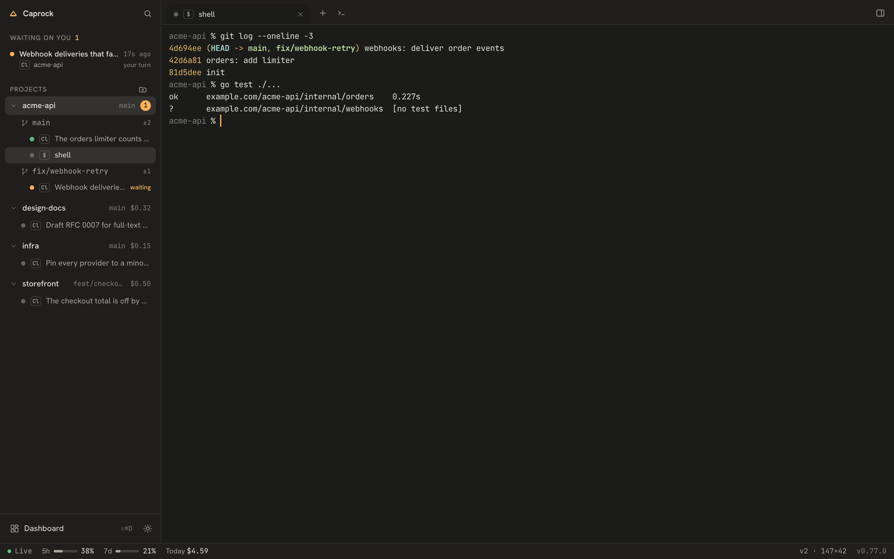
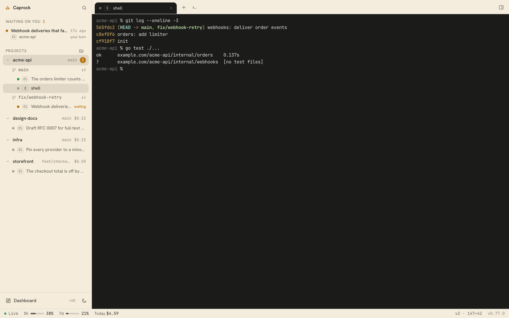

# Using the Caprock desktop app

The app is where you run your coding agents: a terminal for every project,
the sessions that are waiting on you, and the cost and plan limits Caprock
already measures, in one window. It talks to the same local daemon as the
browser dashboard and the phone, so a session started in one is live in the
others. Installing it: [install-app.md](install-app.md).

*Demo projects and sessions, made up for this picture.*

Light theme

## The window

- **Sidebar.** *Waiting on you* comes first: sessions blocked on a permission
  prompt, then sessions whose turn has ended, oldest first. Below it, every
  project with its branch and today's cost (or how many sessions wait), opening
  to its worktrees and the agent sessions and shells in each. The dot says
  what a session is doing: green working, amber waiting, red looping, grey
  idle, hollow ended. Hover a project for *New agent* and *New shell*.
  Sessions in a folder that is not a repository sit under *Other folders*.
  *Dashboard* at the bottom opens Now, Cost, Lifetime and the other screens
  inside the window.
- **Projects.** Caprock lists the repositories your sessions ran in. ⌘O adds
  a folder, makes a new one (`git init` optional) or clones a repository with
  git's progress shown. Branch, changed files and ahead/behind follow commits
  and checkouts made anywhere, the terminal included. Removing a project from
  the list never touches its files.
- **Tabs.** One strip of terminal tabs per project, an agent session or a
  shell each. Tabs come back when you reopen the app. Closing a tab (⌘W)
  never stops its session; *Stop the session…* in the inspector does, after
  asking.
- **Split panes.** ⌘E opens a new shell beside the terminal in front, ⇧⌘E
  below it; ⇧Enter on a session in the palette opens it there. Up to four
  panes a tab. Click a pane or press ⌘[ ⌘] to move between them; drag the
  divider, or focus it and use the arrow keys. ⌘W closes the focused pane and
  its session keeps running.
- **Command palette** (⌘K). Sessions waiting on you come first, then actions,
  tabs, sessions and projects, best match first. Type a task that matches
  nothing — "Add rate limiting to the API" — and Enter opens *New agent* with
  it as the first message, in a new worktree named after it.
- **Terminal.** A real terminal for every session Caprock started and every
  shell, and it keeps running when the app or the daemon restarts. Scrolled
  up, new output never moves what you are reading; a "↓ N new lines" pill
  takes you back down. Drop a file or folder on it from Finder, Explorer or
  your file manager and its path is typed at the prompt, quoted, as in any
  terminal; the agent works on that file, not a copy. Drag a tab along the
  strip to reorder it.
- **Chat.** An agent tab switches between its terminal and its chat with the
  chat button in the tab strip: your prompts, what the agent wrote, and each
  tool call on one line that opens. The field under it types into the
  session.
- **Inspector** (⌘I). The session's agent, model and folder, its cost,
  turns, tokens and context, the permission prompt with its buttons, and the
  uncommitted changes in its checkout. Click a changed file to open it in
  your editor at its first change.
- **Changes.** Click a worktree's ±N in the sidebar (hover the row for the
  same button), *Review and commit* in the inspector, or "Review changes" in
  the palette. The files are listed as *Staged*, *Changes* and *Conflicts*;
  the one selected shows its diff, unified or side by side (**v**). Hover a
  file to stage, unstage or discard it, or press **s**, **u**, **d**;
  **j**/**k** move between files. A diff's *Stage hunk* takes one hunk.
  Discarding throws away a file's unstaged edits, or deletes a new file,
  and asks first; staged work is kept. Write a message (*Use the agent's
  summary* starts one from what the agent said last), then *Commit* (⌘↵) —
  the staged files, or every change when nothing is staged — or *Commit &
  Push* (⇧⌘↵). *Push* publishes a new branch and tracks it, and never
  forces; *Pull* only fast-forwards; *Fetch* refreshes ahead and behind.
  Your git hooks run, and when one refuses, what it printed is shown. The
  commit is made as the author your git config names.
- **Find** (⌘F). A find bar over the terminal you are in: matches light up
  as you type, Enter and ⇧Enter step through them, **Aa** matches case and
  **.\*** takes a regular expression. Esc closes it and you are back in the
  terminal.
- **Open in your editor.** Right-click a project or a worktree in the
  sidebar to open it in VS Code, Cursor, Zed or a JetBrains IDE — whichever
  are installed; the palette and the inspector have *Open in …* too.
  Settings → *Editor* picks the default. Only this computer can do this; a
  paired phone cannot open an editor here.
- **Terminal look.** Settings → *Terminal*: the colours (Caprock, Paper,
  Catppuccin Mocha, Tokyo Night, Solarized Dark), the font (JetBrains Mono,
  or SF Mono, Menlo, Fira Code and other monospace fonts you have), size,
  line height and cursor, with a preview. Every open terminal changes as you
  choose. The defaults match the JetBrains IDE terminal: JetBrains Mono,
  13 px, line height 1.2, no ligatures.
- **Permission mode.** New sessions start in *Bypass · never asks*: the agent
  does not stop to ask before running commands or editing files. The first
  time on a computer, the New agent sheet shows what bypass means and its
  button reads *Accept and start*; that answers Claude Code's own one-time
  warning for good. A paired phone cannot give that consent — accept it once
  at the computer. Settings → *New sessions* → *Start in* picks the mode
  a new session starts in. Continuing a session keeps the mode it was last
  running in — a session you ran with permissions skipped carries on that
  way. The mode shows next to the continue button, where you can change it.
- **Status strip.** Whether the daemon is live, the 5-hour and 7-day plan
  windows, today's spend, the front terminal's size, and a newer Caprock
  when one is out ([Updates](#updates)).

### Keyboard

On macOS:

| Keys        | Does                                    |
| ----------- | --------------------------------------- |
| ⌘T          | New shell in the selected project       |
| ⇧⌘N         | New agent session                       |
| ⌘O          | Add a project (folder, new, clone)      |
| ⌘1–8, ⌘9    | A tab by position; the last tab         |
| ⌃Tab, ⇧⌘[ ] | Next and previous tab                   |
| ⌘W          | Close the tab (the session keeps going) |
| ⌘E, ⇧⌘E     | Split: a new shell beside, below        |
| ⌘[ ]        | Previous and next pane                  |
| ⌘J          | Next session waiting on you             |
| ⌘F          | Find in the terminal                    |
| ⌘K          | Command palette                         |
| ⌘I          | Inspector                               |
| ⌘\          | Hide or show the sidebar                |
| ⇧⌘D         | Dashboard                               |
| ⌘R          | Reload the window (View → Reload)       |

On Windows and Linux each is Ctrl+Shift with the same letter; Ctrl+Shift+C
and Ctrl+Shift+V stay the terminal's copy and paste. Reload is F5 there:
Ctrl+R stays the shell's history search, and F5 in a focused terminal goes
to the program running in it. The terminal's own keys (Ctrl+C, Ctrl+W,
Option as Meta) always reach the terminal.

### After an update

When the daemon is updated while a window is open — the app replaces its
daemon after an upgrade, or `brew upgrade` restarts it under a browser tab —
the page reloads itself onto the new version as soon as it reconnects, on
the screen it was showing. What you typed in a terminal is kept: it lives in
the session, not in the page. If a sheet is open with text in it, the page
does not reload under you; *Reload — Caprock was updated* appears in the
status strip (in a browser, in the header) instead, for when you are done.

The *New agent* sheet needs no mouse. It opens on the first message; Tab and
⇧Tab walk Project, Where, Agent, Model, Permissions, First message, Cancel
and Start; ↑ and ↓ change a choice in place (Space still opens the list);
⌘↩ (Ctrl+Enter off macOS) starts from anywhere in the sheet, and Esc
cancels. The footer names these keys.

## Outside the window

- **Menu bar** (a tray icon on Windows and Linux). On macOS a click on the
  icon opens a small panel under it without leaving the app you are in: what
  needs you first (a permission prompt with **Approve** when the whole
  request fits on the panel, else **Deny** and *Review in Caprock*; then
  sessions whose turn ended), then what is running with its cost, today's
  spend, and the Claude and Codex 5-hour and 7-day windows with when they
  reset. Click a session to open it in the window; Escape or a click
  elsewhere closes the panel. A right click shows the menu: the same figures,
  the sessions waiting for approval, *Show Caprock* and *Quit*. On Windows
  and Linux the menu is the whole tray. On macOS the 5-hour figure and the
  waiting count sit beside the icon.
- **Badge.** The Dock icon (a dot on the Windows taskbar) counts the sessions
  waiting for approval, and clears when none do.
- **Global shortcut.** ⌃⌥⌘C on macOS, Win+Alt+C on Windows and Linux, brings
  the window up from any app, and hides it when it is already in front.
  Change it or turn it off in Settings → *Global shortcut*. Wayland does not
  give apps global shortcuts; the tray's *Show Caprock* still works there.
- **Closing the window.** On macOS Caprock stays in the menu bar; ⌘Q quits.
  On Windows and Linux closing quits. Quitting never stops the daemon or a
  session.

## Notifications

When an agent stops on a permission prompt, the app shows a notification
naming the project, the session and what it wants to do: `Bash: go test
./...`, the file an edit would change, or the question it asked. Nothing is
shown for the session you are already looking at.

On macOS the notification carries buttons:

- **Approve** answers *yes* to that prompt, without bringing Caprock forward.
  It is offered only when the notification shows the whole request, on one
  line and uncut. A longer command offers **Open in Caprock** instead, so you
  read it in the session's terminal before answering.
- **Deny** answers *no*.
- A click on the notification opens the session. Its terminal shows Claude
  Code's own prompt, and Caprock's approval card sits under it, naming the
  tool and the full command.

The card answers from the keyboard, with focus in that session's terminal
too: **Y** for *yes*, **A** for the "don't ask again" option when the prompt
has one, **N** for *no*. In the terminal, Enter and Esc answer Claude Code's
own menu, which means the same *yes* and *no*; with focus off the terminal
they press the card's buttons. Before pressing anything, Caprock reads the menu on the
session's screen and picks that option's own number. If the option is not on
the prompt, it types nothing and asks you to answer in the terminal. When
several prompts wait — a subagent's among them — the card shows the one on
screen and how many more are waiting.

A notification never offers "always allow", because that would write a rule
to your settings. If the prompt was answered in the meantime — in the
terminal, on the card, from the phone — the button does nothing and says
*Already answered*, and the notification is taken away when the prompt goes.
macOS asks once whether Caprock may send notifications.

On Windows and Linux a notification has no buttons; a click opens the
session with its Yes and No buttons.

Settings → *Desktop notifications* has two switches: *waiting for approval*
(on) and *has finished* (off). They are separate from the Telegram alerts in
[Phone alerts](../README.md#hear-about-it-on-your-phone), which stay off until
you turn them on.

## GitHub

Settings → **GitHub** connects your account. Caprock then talks to
`api.github.com` from the daemon; the token never reaches the page or your
phone. Nothing is sent to GitHub until you connect.

**Connecting**, easiest first:

- **Use my GitHub CLI login.** If `gh` is installed and logged in, Caprock
  asks `gh auth token` whenever it needs the token and never writes it down.
  Disconnecting leaves your `gh` login alone. Missing a scope? Run
  `gh auth refresh -s repo,read:org`.
- **Paste a token.** A fine-grained token with *Contents* and *Pull
  requests* read and write, and *Commit statuses*, *Checks* and *Metadata*
  read, on the repositories you want; or a classic token with `repo` and
  `read:org`. Caprock checks it with GitHub before keeping it — in your
  macOS login keychain, or a file in the data directory only you can read
  (on Windows and Linux, or when the keychain is unavailable; Settings says
  so).
- **Sign in with GitHub**, once a Caprock OAuth app is configured (below):
  Caprock shows a code, you enter it on github.com and approve.

Connected, the section shows the account, the scopes, a health line (when
GitHub last answered, requests left this hour, a rate-limit pause, the last
error word for word), *Tell me when CI fails or a review arrives*, and
**Disconnect**, which removes only the token Caprock kept.

**What it does:**

- **Clone from your repositories.** ⌘O → *Clone*, and *Start work → Clone*
  on the phone, list your repositories and your organizations'; search by
  name, pick an owner, *More…* for the next page. Picking one fills the
  address; you can still paste any other.
- **Put a project on GitHub.** In a project with no remote, the Changes view
  offers **Create a GitHub repository…**: private unless you untick it,
  under you or an organization, set as `origin`, and pushed.
- **Open a pull request.** In a worktree's Changes view, **New pull
  request…** fills the title and description from the branch and its
  commits (or the agent's summary), against the default branch, with a
  *Draft* switch. A branch not on GitHub yet is pushed first, with your own
  git credentials. Then the link.
- **Follow it.** The Changes view shows the pull request's checks (the
  failing ones by name), reviews and whether it can be merged; the sidebar
  shows a pull-request icon on the worktree, green, amber or red. Caprock
  reads each repository at most once a minute, less often while nothing
  changes, and right after you push. With the switch on, the app notifies
  you when a check fails or a review arrives.
- **From the phone** you can read all of it; a phone you let control
  sessions can also open a pull request. Connecting, disconnecting and
  creating repositories happen on the computer.

### Turning on "Sign in with GitHub" (for the maintainer, about 5 minutes)

The device flow needs an OAuth app registered once; its client id is public
and there is no secret on anyone's machine.

1. On github.com: **Settings → Developer settings → OAuth Apps → New OAuth
   App** (or the organization's *Developer settings*, to own it there).
2. *Application name* `Caprock`, *Homepage URL* `https://caprock.dev`,
   *Authorization callback URL* `https://caprock.dev` (the device flow does
   not use it, but the form requires one). **Register application**.
3. On the app's page tick **Enable Device Flow** and **Update application**.
   Do not generate a client secret; Caprock does not use one.
4. Copy the **Client ID** (`Ov23…` or `Iv1.…`).
5. Put it in the data directory's `config.json` (`~/Library/Application
   Support/caprock` on macOS unless you moved it) as
   `"github_client_id": "<client id>"`, then restart the daemon
   (`caprock down && caprock up`, or quit and reopen the app). To ship it to
   everyone, make it the default in `internal/config` instead.

Settings → GitHub then shows **Sign in with GitHub**. The app asks for
`repo` and `read:org`. An organization with OAuth app restrictions must
approve the app before its private repositories show up.

## Updates

When a newer Caprock is out, a card in the bottom-right corner says so,
once per version: **Update and restart**, *What's new*, or **Later**. The
status strip keeps **Update to vX.Y.Z — Restart** for when you are ready. One click downloads it (with progress, while you keep working),
checks its signature, installs it and restarts the app. Everything comes
back as it was: every session keeps running (their terminals live outside
the app, and the app moves its daemon onto the new version without ending
them), the same tabs in the same order with the same one in front, splits
and their sizes, the sidebar, the window's size and place, each terminal
scrolled where you left it, and anything you had half typed into an agent. The ▾ beside it
shows what is new, or **Not now** to hide that version.

- **Checking.** On its first launch the app asks once: *Check for updates
  automatically?* With **Yes**, Caprock asks GitHub for the newest version
  number at most every 6 hours; Settings → *Privacy* turns it off again.
  With **No**, nothing is checked until you ask: **Caprock → Check for
  Updates…** on macOS, **Check for Updates…** in the tray menu, or *Check for
  updates* in the command palette (⌘K).
- **What is sent.** The automatic check asks GitHub which release is the
  latest. *Update* and *Check for Updates…* also fetch the release's
  `latest.json` and, when you update, the new app from GitHub's release
  downloads. None of these carries anything about you or your work: no
  account, no identifier, not even your version.
- **What is checked.** Every update is signed with Caprock's release key,
  and the app installs nothing whose signature or version does not match.
  If something fails, the strip says *Update failed* and why, with **Try
  again** and the release page; the running version is left as it was.
- **Where the app updates itself.** The macOS app (from the `.dmg` or
  Homebrew), the Windows installer and the Linux AppImage. On macOS, move
  Caprock to Applications first: run from the disk image it cannot replace
  itself and says so. A Homebrew cask install updates itself too, and `brew
  upgrade` leaves it alone.
- **Where it does not.** The `.deb` and `.rpm` packages belong to your
  package manager: download the new `Caprock-Linux.deb` or
  `Caprock-Linux.rpm` from the
  [release page](https://github.com/dspv/caprock/releases/latest) and
  install it the way you installed the first. The app tells you which.
- **The daemon from Homebrew or Scoop** keeps its own upgrade command
  (`brew upgrade caprock`, `scoop update caprock`); the app never replaces a
  daemon it did not install.

## macOS privacy prompts

macOS asks before a program reads your Desktop, Documents or Downloads
folder (System Settings → Privacy & Security → Files and Folders). Caprock
asks when a session it runs — Claude Code, Codex, a shell — touches one of
them: macOS counts what runs inside Caprock as Caprock, the way it counts
what runs in Terminal as Terminal.

- **What to allow.** Allow the folders your projects live in, or the ones
  you ask an agent to read. Saying no does not break Caprock; that session
  just cannot read that folder.
- **Why it asks again after an update.** Caprock is not yet signed with an
  Apple Developer ID, so to macOS each release is a new program. It asks
  once per release, per folder.
- **Why there are several "caprock" entries without an icon.** Each entry
  is a `caprock` binary at a different place: older Homebrew releases
  (Homebrew keeps each version at its own path), the app's daemon, and
  development builds. The app now runs one daemon from one place
  ([details](install-app.md#the-first-launch)), so a new release replaces
  its entry instead of adding one. Old entries do no harm; to tidy them,
  select one and press **−** under the list. If a session asks again, allow
  it.
- **With a signed release** (Developer ID, once Caprock has an Apple
  developer account): one entry, with Caprock's icon, and no new question
  after an update.

## Your phone

The phone opens the same Caprock in its browser, over your Wi-Fi or over
[Tailscale](https://tailscale.com/download). Nothing passes through a server
of ours.

### Pairing

1. In the app, open *Dashboard* → **settings** → *Open Caprock on your phone*
   and press **Show a code**.
2. Pick the address the QR code carries: **Wi-Fi** for a phone on the same
   network, **Tailscale** (or **Tailscale name**) for a phone that has
   Tailscale on, which then works from mobile data too. The Tailscale choices
   appear when this computer is on Tailscale.
3. Point the phone's camera at the code. It opens Caprock and pairs by itself;
   the six digits and the address are there to type for a phone without a
   camera.

The phone appears under *Paired devices*. It can look but not change anything
until you press **Let it control sessions** beside it; **Take control away**
undoes that at once. The rest of what pairing allows, and why, is in
[Open it on your phone](../README.md#open-it-on-your-phone).

### Working from the phone

A phone you let control sessions can:

- **Start work.** *+ Start work* on Now offers **Clone** (an `https://` or
  `git@` address, into a folder under your home), **New project** and
  **Worktree**. Then **Start an agent here** starts a session and opens its
  chat. A clone runs on the computer: lock the phone or lose the signal
  halfway and the page catches up when it is back, without cloning twice.
- **Chat with a session.** On a phone a session opens on its chat. Type into
  the field and send; **Photo** attaches a picture by putting its path in the
  message. The keys bar has Esc, Tab, the arrows, Enter and Ctrl+C for the
  agent's menus.
- **Answer a permission prompt** with the buttons on the prompt card.
- **Commit and push.** A session's *Changes* tab starts with what is
  uncommitted in its worktree. Tap files to commit only those (nothing
  ticked commits everything), write a message or take the agent's summary,
  then **Commit** or **Commit & Push**; **Pull** and **Fetch** sit under
  them. Only in a project under your home folder. A phone that can only
  look sees the list and no buttons.

It reconnects by itself. The header says where it stands — *Live*,
*Catching up…*, *Reconnecting*, *Offline since* — and says *Live* only when
the computer answered in the last 25 seconds. A message sent while offline
waits as *Will send when connected* and goes when the connection is back,
unless a permission prompt is waiting; then it stays as a draft for you to
send. Keys like Esc and Ctrl+C are never held back to be sent later.
