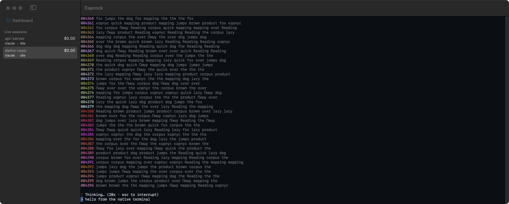

# Caprock for macOS — spike

A native macOS app for Caprock, built to answer one question with numbers: does
a native terminal attached to Caprock's PTY make typing materially better than
the web terminal? **This is a spike, not the product.** It is not built by CI,
not signed, not released, and nothing in `cmd/` or `internal/` depends on it.

## What it does

- **Sidebar.** Live sessions from `GET /v1/sessions?active=true` (project,
  agent, health, cost), polled every 2 s, plus a Dashboard item.
- **Native terminal.** [SwiftTerm](https://github.com/migueldeicaza/SwiftTerm)
  attached to the daemon's existing socket, `WS /v1/agents/{id}/term`: the same
  endpoint, frames and resize message as `ui/src/components/Terminal.tsx`.
  Binary frames are keystrokes, a text frame `{"resize":{"cols":N,"rows":N}}`
  is the size, and the daemon replays its snapshot on connect. The upgrade
  carries `Origin: http://127.0.0.1:<port>`, which is what the loopback origin
  check expects from the browser.
- **Keys.** Cmd+C and Cmd+V through the standard Edit menu; Shift+Enter,
  Ctrl+Enter and Ctrl+J send `ESC CR` like the web terminal; Option is Meta, so
  Option+Enter sends the same.
- **Files.** Pasting a file or an image, or dropping files onto the terminal,
  posts them to `POST /v1/paste` and types the quoted path, as the web does.
- **Dashboard.** The existing web UI in a `WKWebView` at the daemon's URL.
- **Menu bar.** The 5-hour limit from `GET /v1/stats/summary` and the number of
  sessions waiting on you.

It reads the daemon's port and token from `runtime.json` in the data directory,
as the CLI does: `--data-dir`, else `$CAPROCK_DATA_DIR`, else
`~/Library/Application Support/caprock`. It never starts a daemon.

## Build and run

Needs only the Command Line Tools (Swift 5.9 or newer); Xcode is not required.
SwiftTerm is pinned to 1.18.0, the last release whose manifest builds with
Swift 5.10.

```sh
macos/scripts/bundle.sh            # → macos/build/Caprock.app (ad-hoc signed)
open macos/build/Caprock.app --args --data-dir /path/to/data-dir
```



## Measured on 2026-10-04

One machine (Apple Silicon, macOS 14.6.1, 60 Hz display), one isolated daemon
built from master, one fake session per daemon, two runs of 100 keystrokes for
each cell (200 samples). "Load" is the fake's stream in lines per second, on top
of its 12 fps spinner. Web is Chrome, headed, a fresh profile, window 1400×900.
Raw results are in `bench/results-2026-10-04/`.

Keystroke to echo on screen, p50 / p95, in milliseconds:

| client               | load 0      | load 200    | load 1000   |
| -------------------- | ----------- | ----------- | ----------- |
| native, CoreGraphics | 5.7 / 10.0  | 5.6 / 8.7   | 5.5 / 9.1   |
| native, Metal        | 3.7 / 13.0  | 1.2 / 9.4   | 1.1 / 13.6  |
| web, master          | 11.9 / 21.7 | 12.5 / 20.4 | 14.3 / 21.1 |
| web, PR #171         | 17.6 / 26.8 | 18.7 / 26.6 | 19.1 / 26.9 |

Opening a session, to the first keystroke echoed on screen (median of two):

| client             | load 0 | load 200 | load 1000 |
| ------------------ | ------ | -------- | --------- |
| native, click      | 97 ms  | 113 ms   | 101 ms    |
| web master, click  | 434 ms | 466 ms   | 1119 ms   |
| web PR #171, click | 315 ms | 474 ms   | 252 ms    |

For the web, "click" is a route change to the session's Terminal tab with the
dashboard already loaded; for native, the terminal view being created. Both
then type a word every 100 ms until it comes back.

CPU over 20 s of watching the stream without typing (median of two), and
resident memory at the end of each run (range over all six). For Chrome, "tab"
is the renderer and GPU processes, which is what one more tab costs when
Chrome is already open; "all" is every process of that Chrome instance:

| client               | CPU, load 0 | CPU, load 1000 | memory     |
| -------------------- | ----------- | -------------- | ---------- |
| native, CoreGraphics | 7%          | 14%            | 34–53 MB   |
| native, Metal        | 10%         | 25%            | 30–53 MB   |
| web master, tab      | 5.5%        | 20%            | 278–442 MB |
| web master, all      | 24%         | 36%            | 435–732 MB |

Cold start of the native app to the first echoed keystroke: 0.7–1.2 s with
CoreGraphics. With Metal it was 1.1–1.6 s, and 3.4–6.5 s on the first Metal
run of each round, likely SwiftTerm compiling its shaders from source at run
time (not verified).

What this does and does not say:

- **Echo latency is not where the difference is.** Native is 6–13 ms faster at
  p50, but up to one 60 Hz frame of the web figure is vsync alignment the
  native measurement stops before (see below), and neither client stalled at
  1000 lines a second.
- **Opening a session and memory are.** About 0.1 s against 0.3–1.1 s, and
  30–53 MB against 278–442 MB for the tab.
- **CPU is not better natively.** Metal halves latency against CoreGraphics
  and doubles CPU; CoreGraphics is the better default.
- **Typing comfort was not measured.** Focus, browser shortcuts (Cmd+W, Cmd+L,
  Cmd+number), the Dock and Cmd+Tab are what a native window changes, and none
  of them is a latency.
- **Grids differ slightly.** Native drew 195×40, web 194×35 (master) and
  186×35 (PR #171): the web drew fewer rows.
- **The fake changed after the run.** It drew its spinner and its input row on
  the same last row during the benchmark; the spinner moved up one row
  afterwards, for the screenshots. The echo bytes were the same.

## The benchmark

The tools are in `bench/`:

- `fake-claude` — a stand-in `claude` (no model calls): 4000 lines at start, a
  stream of coloured lines at a rate read from `.fake_lps` in its working
  directory, a 12 fps spinner, raw mode, and an input row redrawn as
  `> <typed>` on every byte.
- `stand.sh` — an isolated daemon (own HOME, data dir and port) with that fake
  first on PATH and one session started through `POST /v1/agents`.
- `native.sh` — runs the app's built-in benchmark, `Sources/CaprockMac/Bench.swift`.
- `web.mjs` — the same benchmark for the web terminal in a headed Chrome over
  the DevTools protocol. It needs a dashboard build with one extra line in
  `Terminal.tsx`, right after the `Xterm` is constructed:
  `(window as any).__caprockTerm = term`, so it can wait until xterm.js has
  parsed the echo.
- `summarize.py` — pools the per-key samples into the table.

Both clients are timed the same way. A key is injected into the app's own
event path (an `NSEvent` posted to the application queue; a DevTools
`Input.dispatchKeyEvent` for Chrome) and timed from the event's own timestamp.
The fake echoes it; the run waits for `> <typed>` on the socket, then for the
frame that shows it:

- **native** — the bytes were fed to SwiftTerm, SwiftTerm updated the display,
  and the main run loop reached its before-waiting point, where AppKit commits
  the frame;
- **web** — xterm.js finished parsing everything queued (`term.write('', cb)`),
  the next animation frame ran, and a task after it.

Both stop when the frame is handed to the compositor, not when it reaches the
screen. Chrome's animation frame waits for vsync before that point and AppKit's
commit does not, so the web figure can include up to one frame (16.7 ms at
60 Hz) that the native one does not.
